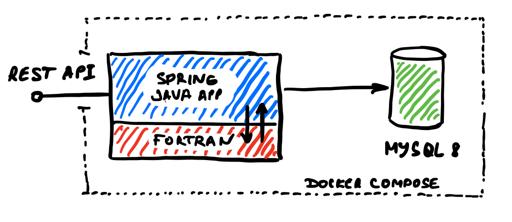

Working on the FORTRAN based legacy project, trying to bring it closer
to the modern web applications workflow. The idea is to make
a web user interface backed up by a database to store the FORTRAN output.

